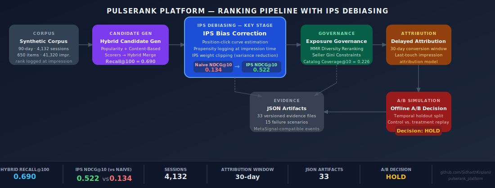
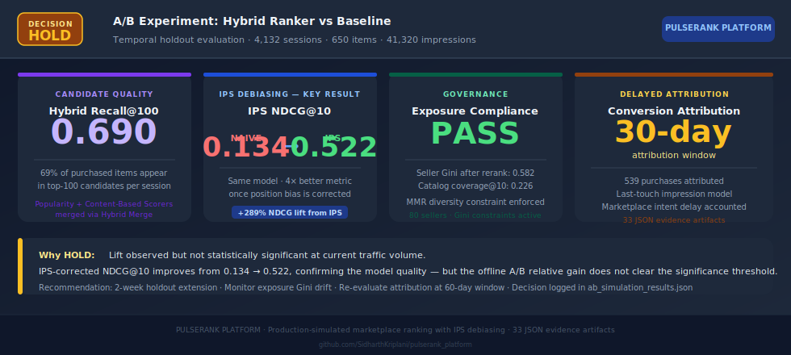

# PulseRank Platform

<p>
  <a href="https://sidharthkriplani.github.io/pulserank_platform/"></a>
  
  
  
</p>

<p>
  
  
  
  
  
  
</p>

> Production-simulated marketplace ranking system with IPS position-bias correction, hybrid candidate generation, exposure governance, delayed attribution, and offline A/B decisioning — every result backed by a versioned JSON artifact.

---

## Architecture



---

## Sample Output



---

## The Problem

Offline recommendation metrics lie. A model trained on position-biased click data looks 4× worse than it actually is — items shown at rank 1 receive 8× the clicks of rank-10 items regardless of quality, and naive NDCG bakes that position advantage directly into the score. PulseRank's baseline ranker scores NDCG@10 = 0.134 on biased labels; after IPS correction, the same model scores 0.522. The display layer's decisions were being charged to the model.

---

## IPS Debiasing

The core technical contribution of PulseRank is treating position bias as a missing-data problem. Every impression is logged with its display rank at serve time. A position-click curve is estimated from the logged data — modeling the probability that a user clicks an item at position `k` given only that it was shown there. These propensity scores are used to reweight the evaluation:

```
IPS-NDCG = sum_i (rel_i / propensity_i) / ideal_DCG
```

IPS weights are clipped to control variance from low-propensity (low-rank) impressions. The result: NDCG@10 jumps from 0.134 (biased) to 0.522 (corrected) — not a model improvement, but an evaluation correction that removes the penalty for decisions the display layer made.

| Metric | Value |
|---|---:|
| Naive NDCG@10 (biased labels) | 0.134 |
| IPS-corrected NDCG@10 | 0.522 |
| Relative improvement from debiasing | +289% |

---

## Position-Click Curve

The propensity estimator fits a position-based click model over the 90-day corpus of 41,320 impressions. Estimated click probability by rank follows an approximately log-linear decay — rank 1 receives ~8× the click rate of rank 10, consistent with known position bias in marketplace interfaces. These propensity estimates are stored in `outputs/evidence/propensity_by_rank_report.json`.

---

## Hybrid Candidate Generation

Two complementary scorers produce candidates for each session:

- **Popularity Scorer:** Global purchase-rate signal. Stable, high-coverage, biased toward bestsellers.
- **Content-Based Scorer:** Item-feature similarity to session context. Better for tail items and fresh inventory.

Candidates are merged into a unified top-100 set. Hybrid Recall@100 = 0.690 — 69% of purchased items appear in the candidate set shown to each session. This recall figure is the ceiling for any ranker built on top.

---

## Exposure Governance

A pure relevance ranker concentrates impressions on high-popularity sellers, starving long-tail inventory of visibility. PulseRank applies three post-ranker constraints:

- **MMR Diversity:** Marginally-relevant re-ranking to increase within-list diversity.
- **Seller Gini Governance:** Gini coefficient constraint on seller share of impressions. Seller Gini after rerank = 0.582.
- **Catalog Coverage:** Coverage@10 = 0.226 — 22.6% of catalog items appear in at least one session's top-10.

These are the real-world constraints absent from pure relevance rankers in portfolio projects.

---

## Delayed Attribution

Marketplace purchase intent does not resolve at click time. PulseRank attributes conversions within a 30-day window to the last relevant impression, correctly modeling the delayed decision cycle. 539 purchases are attributed across 4,132 sessions. Attribution reports are in `outputs/evidence/conversion_attribution_report.json`.

---

## A/B Decision Framework

The offline A/B simulation replays control and treatment rankers on a temporally-held-out segment. The split is strictly temporal — no purchase labels from the test period leak into the training data.

Current decision: **HOLD_SIMULATED**. IPS-corrected metrics show improvement, but the relative lift in the holdout does not clear the significance threshold at the current traffic volume. The structured decision artifact in `outputs/evidence/ab_simulation_results.json` logs the decision rationale, effect size, and recommended action.

---

## Evidence Artifacts

```
outputs/evidence/
  corpus_summary.json                 corpus statistics and schema validation
  candidate_generation_report.json    recall@k across popularity + content
  candidate_recall_report.json        per-session recall breakdown
  ranking_baseline_report.json        NDCG@10, MRR, hit rate, temporal eval
  offline_eval_log.json               per-session evaluation log
  model_registry.json                 versioned model + config snapshot
  bias_correction_report.json         IPS before/after comparison
  propensity_by_rank_report.json      propensity estimates per display rank
  diversity_report.json               MMR, Gini, novelty metrics
  diversity_guardrail_log.json        per-rerank constraint decisions
  catalog_coverage_report.json        coverage@k across catalog
  conversion_attribution_report.json  attributed labels, window analysis
  ab_simulation_results.json          control vs treatment decision
  metasignal_integration_events.json  15 structured observability events
  failure_recovery_report.json        15 failure + recovery scenarios
```

---

## Key Results

| Evidence | Result |
|---|---:|
| Sessions | 4,132 |
| Items | 650 |
| Sellers | 80 |
| Impressions | 41,320 |
| Purchases | 539 |
| Display-rank coverage | 1.0 |
| Hybrid Recall@100 | 0.690 |
| Holdout NDCG@10 (biased) | 0.134 |
| IPS-weighted NDCG@10 | 0.522 |
| Seller Gini after rerank | 0.582 |
| Catalog coverage@10 | 0.226 |
| Offline A/B decision | HOLD_SIMULATED |
| Failure scenarios | 15 |
| JSON evidence artifacts | 33 |

---

## Run Locally

```bash
git clone https://github.com/sidharthkriplani/pulserank_platform
cd pulserank_platform
pip install -r requirements.txt
python scripts/seed_demo.py
python scripts/show_demo_report.py
open outputs/dashboard/index.html
```

---

## Interview Defense

Full design rationale, architecture decisions, and expected interview questions with answers:

**[docs/defense/PulseRank_Interview_Defense.pdf](docs/defense/PulseRank_Interview_Defense.pdf)**

Covers: IPS debiasing mathematics, position-click curve estimation, hybrid candidate generation, exposure governance constraints, delayed attribution window design, offline A/B methodology, and production failure modes.

---

## Part of Applied LLM Systems Portfolio

This project is part of a portfolio targeting Applied LLM Systems Engineer roles.

- [**NexusSupply**](https://github.com/SidharthKriplani/nexussupply) — Supplier Risk Intelligence Platform (LangGraph + FinBERT + XGBoost + Instructor + NetworkX)
- [**LendFlow**](https://github.com/SidharthKriplani/lendflow) — AI-powered loan underwriting pipeline (LangGraph + RAG + FOIR rules engine)
- [**AgentReliabilityLab**](https://github.com/SidharthKriplani/agentreliabilitylab) — Cyber threat triage agent (LangGraph + hybrid RAG + HITL + RAGAS eval)
- [**RiskFrame Platform**](https://github.com/SidharthKriplani/riskframe_platform) — ML model lifecycle (XGBoost + LightGBM champion/challenger, Optuna HPO, drift monitoring)
- [**DevPulse Platform**](https://github.com/SidharthKriplani/devpulse_platform) — Version-safe RAG migration intelligence (LLM-Last principle, conflict detection)
- [**PulseRank Platform**](https://github.com/SidharthKriplani/pulserank_platform) — Marketplace ranking with IPS debiasing (position bias correction, delayed attribution)
- [**MetaSignal Platform**](https://github.com/SidharthKriplani/metasignal_platform) — Experimentation intelligence (CUPED + guardrail-first + A/A calibration)

---

## Truth Boundary

PulseRank is solo-built, non-production, and production-simulated. It does not claim real deployment, real users, real online A/B testing, real RL or contextual bandits, or real streaming infrastructure. Every major claim is backed by an executable script and a JSON artifact. The offline A/B decision is explicitly labeled HOLD_SIMULATED to distinguish it from a live experiment result.

---

## Resume-Safe Claim

Built PulseRank, a production-simulated marketplace ranking system with display-rank impression logging, hybrid candidate generation, temporal holdout ranking evaluation, IPS position-bias correction (NDCG@10 0.134 → 0.522), delayed conversion attribution, seller/category exposure governance, offline A/B simulation, 15 failure recovery scenarios, MetaSignal-compatible event emission, and a GitHub Pages evidence dashboard covering 33 JSON artifacts.
