# PulseRank Platform

**Production-simulated marketplace recommendation and ranking decision system with IPS bias correction, delayed attribution, exposure governance, offline A/B simulation, and evidence artifacts.**

<p>
  <a href="https://sidharthkriplani.github.io/pulserank_platform/"></a>
  
  
  
</p>

<p>
  
  
  
  
  
  
</p>

---

## Architecture

```mermaid
flowchart TD
    CORPUS["📦 Synthetic Marketplace Corpus\n90-day deterministic seed\n4132 sessions · 650 items · 41320 impressions\nDisplay-rank logged at impression time"] --> CG

    subgraph CG["Candidate Generation  src/pulserank/core/"]
        POP["Popularity Scorer\nGlobal purchase rate signal"]
        CB["Content-Based Scorer\nItem feature similarity"]
        HYB["Hybrid Merge\nRecall@100 = 0.690"]
    end

    CG --> RB

    subgraph RB["Ranking Baseline  src/pulserank/ranking/"]
        SPLIT["Temporal Train/Test Split\nNo data leakage"]
        RANK["Baseline Ranker\nHoldout NDCG@10 = 0.134"]
    end

    RB --> IPS

    subgraph IPS["IPS Bias Correction  src/pulserank/evaluation/"]
        PROP["Propensity Estimator\nPosition-based click model"]
        CLIP["IPS Weight Clipping\nVariance reduction"]
        EVAL["Debiased Evaluation\nIPS NDCG@10 = 0.522"]
    end

    IPS --> RR

    subgraph RR["Reranking Constraints  src/pulserank/ranking/"]
        MMR["MMR Diversity\nMarginally relevant re-ranking"]
        GINI["Seller Gini Governance\nGini after rerank = 0.582"]
        COV["Catalog Coverage\nCoverage@10 = 0.226"]
    end

    RR --> AB

    subgraph AB["Attribution + A/B  src/pulserank/simulation/"]
        ATTR["Delayed Conversion Attribution\n30-day attribution window"]
        SIM["Offline A/B Simulation\nControl vs treatment"]
        DEC["Decision Gate\nHOLD_SIMULATED"]
    end

    AB --> OUT

    subgraph OUT["Evidence + Observability"]
        FAIL["15 Failure Scenarios\nRecovery paths documented"]
        MS["MetaSignal-Compatible Events\n15 structured events"]
        DASH["GitHub Pages Dashboard\n33 JSON artifacts"]
    end
```



---

## Key Results

| Evidence | Result |
|---|---:|
| Sessions | 4,132 |
| Items | 650 |
| Sellers | 80 |
| Impressions | 41,320 |
| Purchases | 539 |
| Display-rank coverage | 1.0 |
| Hybrid Recall@100 | 0.690 |
| Holdout NDCG@10 (biased) | 0.134 |
| IPS-weighted NDCG@10 | 0.522 |
| Seller Gini after rerank | 0.582 |
| Catalog coverage@10 | 0.226 |
| Offline A/B decision | HOLD_SIMULATED |
| MetaSignal-compatible events | 15 |
| Failure scenarios | 15 |
| JSON evidence artifacts | 33 |

The jump from NDCG@10 = 0.134 to IPS NDCG@10 = 0.522 is the debiasing effect — position-biased click data was making the baseline ranker look worse than it actually was.

---

## What PulseRank demonstrates

**Display-rank impression logging.** Every impression is logged with its display rank, enabling propensity estimation. This is the foundational requirement for any debiased offline evaluation.

**Hybrid candidate generation.** Popularity and content-based signals are merged into a candidate set. Hybrid Recall@100 = 0.690 means 69% of purchased items appear in the top-100 candidates shown to each session.

**Temporal holdout evaluation.** Train/test split is strictly temporal — no leakage of future purchase labels into training, which is the primary failure mode in recommendation offline eval.

**IPS position-bias correction.** A position-based click model estimates propensity for each display rank. IPS weights are clipped to control variance. The debiased NDCG@10 is 0.522 vs 0.134 naive — the naive metric severely understated quality because high-rank impressions had much higher click probability by position alone.

**Reranking with exposure constraints.** Post-ranker applies MMR for diversity, seller Gini governance to prevent one seller dominating results, and catalog coverage enforcement. These are the real-world constraints missing from pure relevance rankers.

**Delayed conversion attribution.** Purchases within a 30-day window are attributed to the last relevant impression. This is the correct attribution model for marketplace recommendation where purchase intent takes days or weeks to convert.

**Offline A/B simulation.** Control vs treatment replay produces a structured decision. The current decision is HOLD_SIMULATED — the challenger does not show sufficient lift to justify a launch recommendation.

**15 failure scenarios.** Covers cold-start (new items, new users), popularity collapse, attribution window edge cases, Gini constraint violations, and propensity estimation failures. Each has a documented recovery path.

---

## Evidence artifacts

```text
outputs/evidence/
  corpus_summary.json                 ← corpus statistics and schema validation
  candidate_generation_report.json    ← recall@k across popularity + content
  candidate_recall_report.json        ← per-session recall breakdown
  ranking_baseline_report.json        ← NDCG@10, MRR, hit rate, temporal eval
  offline_eval_log.json               ← per-session evaluation log
  model_registry.json                 ← versioned model + config snapshot
  bias_correction_report.json         ← IPS before/after comparison
  propensity_by_rank_report.json      ← propensity estimates per display rank
  diversity_report.json               ← MMR, Gini, novelty metrics
  diversity_guardrail_log.json        ← per-rerank constraint decisions
  catalog_coverage_report.json        ← coverage@k across catalog
  conversion_attribution_report.json  ← attributed labels, window analysis
  ab_simulation_results.json          ← control vs treatment decision
  metasignal_integration_events.json  ← 15 structured observability events
  failure_recovery_report.json        ← 15 failure + recovery scenarios
```

## Run locally

```bash
git clone https://github.com/sidharthkriplani/pulserank_platform
cd pulserank_platform
pip install -r requirements.txt
python scripts/seed_demo.py
python scripts/show_demo_report.py
open outputs/dashboard/index.html
```

---

## Truth boundary

PulseRank is solo-built, non-production, and production-simulated.

It does **not** claim real production deployment, real users served, real online A/B testing, real revenue optimization, real RL or contextual bandits, real ad-auction integration, or real streaming infrastructure.

Every major claim is backed by an executable script and a JSON artifact. The offline A/B decision is explicitly labeled HOLD_SIMULATED to distinguish it from a live experiment result.

---

## Resume-safe claim

Built PulseRank, a production-simulated marketplace ranking system with display-rank impression logging, hybrid candidate generation, temporal holdout ranking evaluation, IPS position-bias correction, delayed conversion attribution, seller/category exposure governance, offline A/B simulation, 15 failure recovery scenarios, MetaSignal-compatible event emission, and a GitHub Pages evidence dashboard covering 33 JSON artifacts.
